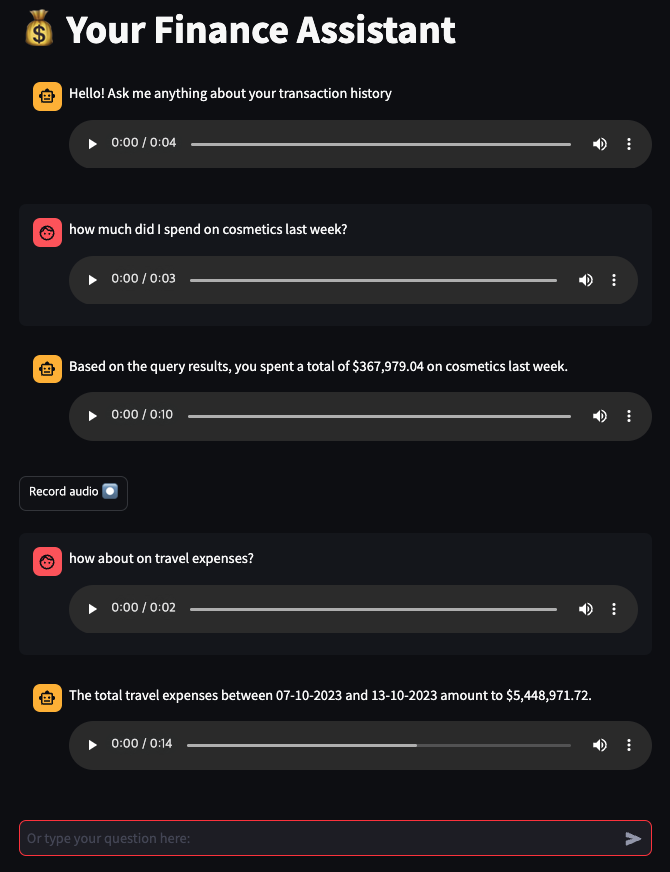
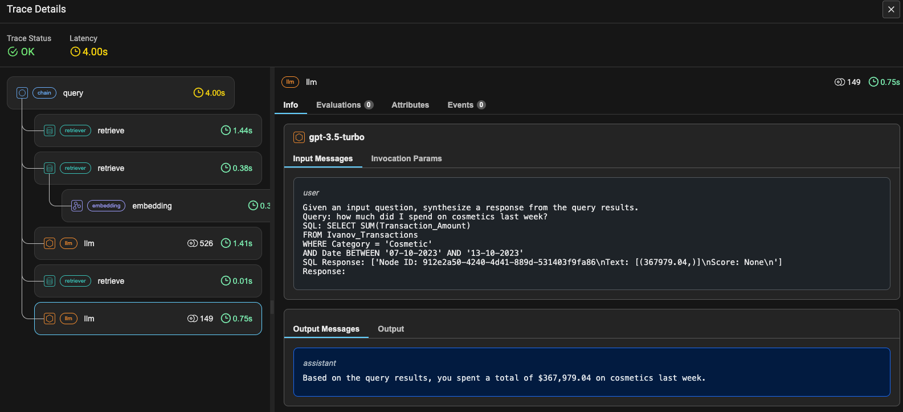
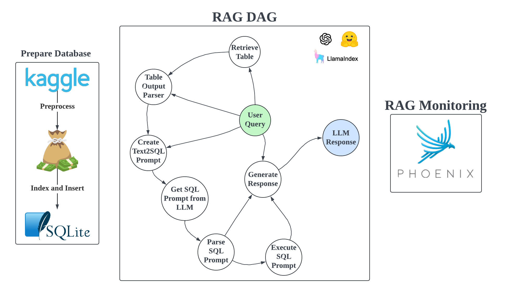

# :speech_balloon: Chat, Talk, Learn and Analyse your spending habits with your Personal Finance Assistant

* Used Dataset - [Kaggle](https://www.kaggle.com/datasets/rajatsurana979/comprehensive-credit-card-transactions-dataset)
* Database - SQLite
* LLM - OpenAI's GPT
* Audio Transcription Model - openai/whisper-small from [HuggingFace](https://huggingface.co/openai/whisper-small)
* RAG pipeline - [LlamaIndex](https://docs.llamaindex.ai/en/stable/module_guides/querying/pipeline/)
* Monitoring/Tracing - [Azire Pheonix](https://github.com/Arize-ai/phoenix)
* User Interface - Streamlit

# Demo

[demo-vid](https://github.com/user-attachments/assets/142edc42-1c36-4e58-9b46-851876f077f3)

# Preprocessed Data sample

| Name | Surname | Gender | Transaction Amount |    Date    |         Merchant Name          |   Category   |
|------|---------|--------|--------------------|------------|--------------------------------|--------------|
| Ivan | Ivanov  | M      |              35.47 | 03-04-2023 | Smith-Russell                  | Cosmetic     |
| Ivan | Ivanov  | M      |            2552.72 | 17-07-2023 | Peck, Spence and Young         | Travel       |
| Ivan | Ivanov  | M      |             115.97 | 20-09-2023 | Steele Inc                     | Clothing     |

# User Interface

* communicate through text or speech
* ask follow-up questions (the language model can see the chat history)



# Monitoring 

* on the dev side, see how the RAG is performing by analysing prompts and retrieved information



# :bar_chart: Project diagram 



# :evergreen_tree: Repository Structure 

```
├── app/
│   ├── app.py (streamlit)
│   ├── table_index_dir/
│   │   └── Ivanov_Transactions/
│   │       ├── (data index files) *.json
│   ├── table_info_directory/
│   │   └── (data) 0_Ivanov_Transactions.json
│   └── (data) transactions.db
├── dev/
│   ├── (files used for setup and during development)
├── Makefile
├── project-info/
├── README.md
└── requirements.txt
```

# Reproduction

1. Clone the repo `git clone https://github.com/divakaivan/finance_voice_assistant.git` 
2. Add your OPENAI_API_KEY to .env
3. Run `make` in the terminal, and you should see:
```
Usage: make [option]

Options:
  help                 Show this help message
  install              Install dependencies
  data                 Prepare data for the app (will overwrite any existing data)
  start                Start app
  del-audio            Delete any generated audio files
```
If running for the first time, run the setup:
* `make install`
* `make data`

Otherwise:
* `make start` - this will open the streamlit UI in your browser on `http://localhost:8501`. Also RAG monitoring on `http://127.0.0.1:6006`

# Future improvements

* improve speech input/output
  * speech input uses a 3rd party component as there is no official audio input API by streamlit
* evaluate SQL queries
* at the moment there is a prompt validation step using gpt-4o-mini, but there could be a better way
